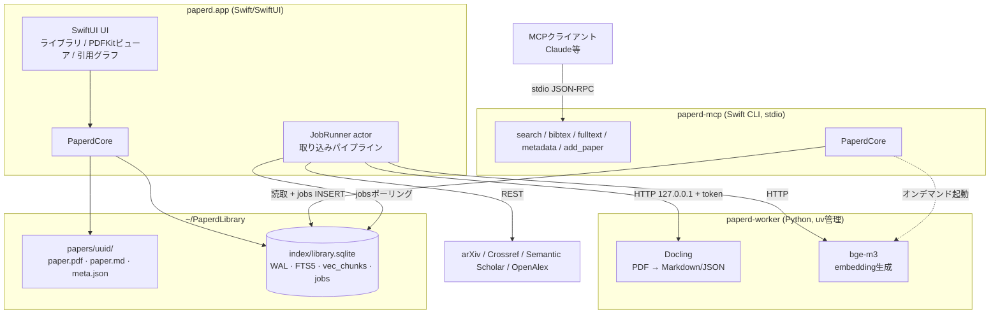

# 01. アーキテクチャ

## 1. 全体構成: 3プロセス + 共有ライブラリ



| コンポーネント | 役割 | 技術 |
|---|---|---|
| `paperd.app` | UI、PDFビューア、ジョブオーケストレーション、DB書き込みの主体 | Swift / SwiftUI |
| `paperd-worker` | PDF→Markdown変換、embedding生成 | Python（uv管理）。アプリ/MCPが子プロセスとして起動 |
| `paperd-mcp` | MCPクライアントへのツール提供 | Swift CLI（stdio）。アプリバンドル内 `Contents/Helpers/` に同梱 |
| `PaperdCore` | DB アクセス、検索、bibtex生成、メタデータ解決、ワーカー起動の共有ロジック | SwiftPMローカルパッケージ。アプリとMCPの双方がリンク |

### 設計原則

1. **ファイルが正本、SQLiteは再構築可能なインデックス**（→ [03](03-library-layout.md)）
2. **重い処理（変換・embedding）はPythonワーカーに集約**し、Swift側はオーケストレーションに徹する
3. **プロセス間の書き込み競合は `jobs` キューで構造的に回避**する（→ 5節、[04](04-ingest-pipeline.md)）
4. ロジックの二重実装を避けるため、アプリとMCPは `PaperdCore` を共有する

## 2. リポジトリ構成（実装時）

```
paperd/
  Paperd/                 # macOSアプリ (SwiftUI)
  PaperdCore/             # 共有SwiftPMパッケージ
    Sources/PaperdCore/
      Database/           # GRDB.swift, マイグレーション
      Search/             # ハイブリッド検索, RRF
      Bibtex/             # bibtex生成
      Metadata/           # arXiv/Crossref/S2/OpenAlexクライアント
      Worker/             # Pythonワーカーのライフサイクル管理・HTTPクライアント
      Library/            # ファイルレイアウト, meta.json入出力
  PaperdMCP/              # MCPサーバCLI
  worker/                 # Pythonワーカー (pyproject.toml, uv.lock)
  docs/                   # 本設計書
```

## 3. Pythonワーカー

### 3.1 IPC: localhost HTTP + 認証トークン

- ワーカーは起動時に **127.0.0.1 のランダムポート** で FastAPI サーバを立てる
- 起動引数で渡される**ワンタイムシークレットトークン**を全リクエストの `Authorization` ヘッダで検証
- ポート番号はワーカーが標準出力に1行JSON（`{"port": 51234}`）で通知し、親プロセスが読み取る

stdio JSON-RPCではなくHTTPを選ぶ理由: (a) 長時間ジョブの進捗通知（ポーリング/SSE）、(b) 複数リクエストの並行処理、(c) `curl` で叩けるデバッグ容易性。

APIエンドポイント仕様は [05-pdf-conversion.md](05-pdf-conversion.md) と [06-search-rag.md](06-search-rag.md) を参照。

### 3.2 ライフサイクル

- **アプリから**: **アプリ起動時に自動起動**（設定「アプリ起動時にワーカーを自動起動」、既定ON）し、以後常駐。**アプリ終了時に停止する**（残留ワーカーによるメモリ占有の防止。MCPは必要時にオンデマンドで再起動できる）。ワーカーはユーザが意識しないインフラとして扱い、状態はステータスバーのインジケータで可視化する（→ [09](09-ui.md) 9節）
- **MCPから**: semantic検索のクエリembedding生成時にオンデマンド起動。**アイドルタイムアウト（既定10分）で自動終了**する常駐モード
- 多重起動の防止: `~/Library/Application Support/paperd/worker.lock`（PID + ポート + トークンのファイルロック）。既存ワーカーが生きていれば再利用する。**再利用時は `/health` のバージョンを照合し、期待バージョンと不一致なら旧プロセスを終了して起動し直す**（コード更新後に旧ワーカーが残留し、新しいオプションが黙って無視される事故の防止）

### 3.3 Python環境のセットアップ（uv方式）

**配布バンドルでのワーカー配置**: 配布された `.app` は `Contents/Resources/worker/` に
ワーカーのソース（pyproject.toml / uv.lock / src/）を同梱する。初回起動時にアプリが
`~/Library/Application Support/paperd/worker/` へ展開して `workerDir` の既定値とし、
バージョンが上がったら（pyproject.tomlのversion比較）ソースを上書き更新する（`.venv` は温存し、
`uv run` の自動同期で差分適用される）。開発ビルドではリポジトリ内 `worker/` を直接使う（→ docs/09 9節）。

**uvの探索**: GUIアプリのPATHにはhomebrew等が含まれないため、`uv` は既知の場所
（`/opt/homebrew/bin` / `/usr/local/bin` / `~/.local/bin` / `~/.cargo/bin`）とPATHから明示的に探索する。
未検出の場合は設定画面でインストール方法（`brew install uv` 等）を案内する。

Docling + PyTorch で環境サイズが2〜3GBになるため、アプリバンドルへの同梱はしない。

1. アプリ初回起動時のセットアップウィザードで `uv` バイナリ（軽量・アプリ同梱）を使い、`uv sync` で `~/Library/Application Support/paperd/python/` にPython環境を構築
2. embeddingモデル（bge-m3）は初回利用時に `models/` へダウンロード
3. ウィザードは進捗表示・中断再開・オフライン時の明示的エラーを備える（→ [09](09-ui.md)）
4. ワーカーのコード（`worker/`）はアプリバンドル内 `Contents/Resources/worker/` に同梱し、環境のみ外部構築

## 4. MCPサーバ

- **トランスポート**: stdio のみ（MCPクライアントが子プロセスとして起動）
- **配置**: `paperd.app/Contents/Helpers/paperd-mcp`。アプリが起動していなくても単独で動作する
- **SDK**: Swift MCP SDK を**薄いアダプタ層でラップ**し、SDK差し替え（公式 ↔ コミュニティフォーク ↔ 自前stdio実装）を可能にする。MCP仕様のうち tools のみ使用し、依存面積を最小化する
- アプリ内に「MCP設定スニペットをコピー」するUIを設け、`claude_desktop_config.json` 等への登録を補助する

ツール定義・書き込み設計は [07-mcp-server.md](07-mcp-server.md) を参照。

## 5. SQLite の多プロセス共有

- **WALモード** + `busy_timeout = 5000ms` で運用。複数プロセスからの並行読み取り + 短時間の書き込みは安全に成立する
- 書き込みの原則:
  - **アプリ（JobRunner）が長時間処理を伴う書き込みの唯一の主体**
  - MCPサーバの書き込みは「`jobs` テーブルへの短いINSERT」と「メタデータ解決結果の `papers` 行INSERT」に限定
- アプリへのジョブ通知: MCPがジョブ投入後に `DistributedNotificationCenter` で通知（補助）。主たる駆動はアプリ側JobRunnerの定期ポーリング（既定5秒間隔、アイドル時は間隔を延長）
- スキーマ詳細は [02-data-model.md](02-data-model.md)

## 6. URLスキーム

アプリは `paperd://` カスタムURLスキームを登録する（`CFBundleURLTypes`）。

| URL | 動作 |
|---|---|
| `paperd://import?url=<encoded-url>` | URLを取り込みパイプラインへ投入（外部連携の汎用入口。v2のブラウザ取り込み案 → [11](11-browser-capture.md) でも利用） |
| `paperd://import?arxiv=<id>` / `?doi=<doi>` | ID指定の取り込み |
| `paperd://paper/<uuid>` | 該当論文を開く（検索結果からのディープリンク用） |

## 7. 配布形態

### リリース手順（scripts/release.sh）

1. `CODESIGN_IDENTITY="Developer ID Application: ..."` を設定（Apple Developer Programの証明書）
2. `xcrun notarytool store-credentials <profile>` でnotarization認証を登録し `NOTARY_PROFILE` に設定
3. `scripts/release.sh` を実行 → Releaseビルド → Hardened Runtime署名（ヘルパー→アプリの順、
   `--deep` は使わない）→ notarization → staple → zip生成
- ワーカーのPython環境は.appに含まれない（ユーザ環境でuvが構築）ため、署名対象はSwiftバイナリのみ
- 環境変数未設定時はad-hoc署名で動作確認用ビルドになる

### Homebrew配布（自前tap）

主たる配布チャネルはHomebrew cask（`brew install --cask paperd-app/paperd/paperd`）。
caskが `depends_on formula: "uv"` を宣言するため、**uvのインストールが自動解決される**
（最大のオンボーディング障壁の解消）。GitHub Releasesのzipを併記の直接DLとして案内する。

1. GitHubに `homebrew-paperd` リポジトリ（tap）を作る
2. `scripts/release.sh`（既定リポジトリ: paperd-app/paperd） が `dist/Casks/paperd.rb`
   （version / sha256 / URL埋め込み済み）を生成するので、tapの `Casks/` へコピーしてpush
3. zipはGitHub Releasesに `v{version}` タグでアップロード
4. 知名度がついたら homebrew/cask 本体への収載を検討（それまでは自前tap）

### ライセンス

**FSL-1.1-Apache-2.0**（Functional Source License）。ソース公開・個人/研究利用は自由・
競合する商用再配布のみ禁止・各リリースは公開2年後にApache 2.0へ自動転換（→ LICENSE.md）。
依存ライブラリ（GRDB / Docling / bge-m3 / ocrmac等）はすべてMITで商用利用可。

### ローカリゼーション

UI文言は ja / en の2言語（システム言語追従、ベース言語ja → [09](09-ui.md) 10節）。
Core / MCP / CLI / スキルの文字列は英語固定。ビルドへの影響:

- `Package.swift`: Paperd ターゲットに `defaultLocalization: "ja"` と `Localizable.xcstrings` リソースを宣言
- `scripts/make-app.sh`: `xcrun xcstringstool compile` で xcstrings を `en.lproj/Localizable.strings` に
  コンパイルして `Contents/Resources/` へ置き、Info.plist に
  `CFBundleDevelopmentRegion` / `CFBundleLocalizations` を書き込む

- **Developer ID 署名 + notarization による直接配布**（dmg / Sparkleによる自動更新を想定）
- Mac App Store は対象外: Pythonサイドカーの実行・外部プロセス起動が App Sandbox と非互換のため
- アプリ本体・`paperd-mcp`・同梱 `uv` はすべて署名対象。Pythonワーカー環境は実行時構築のためユーザ領域に置き、署名対象外（Gatekeeperの制約を受けない）

## 8. 主要な外部依存

| 依存 | 用途 | ライセンス |
|---|---|---|
| GRDB.swift | SQLiteアクセス | MIT |
| sqlite-vec | （v1未使用）将来のベクトル検索候補。システムSQLiteが拡張をロードできないため、v1はSwift側ブルートフォースKNNで代替（→ [06](06-search-rag.md) 3節） | MIT/Apache-2.0 |
| Docling | PDF→Markdown/JSON変換 | MIT |
| sentence-transformers + bge-m3 | embedding生成 | Apache-2.0 / MIT |
| FastAPI + uvicorn | ワーカーHTTPサーバ | MIT |
| uv | Python環境管理 | MIT/Apache-2.0 |
| Swift MCP SDK | MCPサーバ実装（薄くラップ） | MIT |
