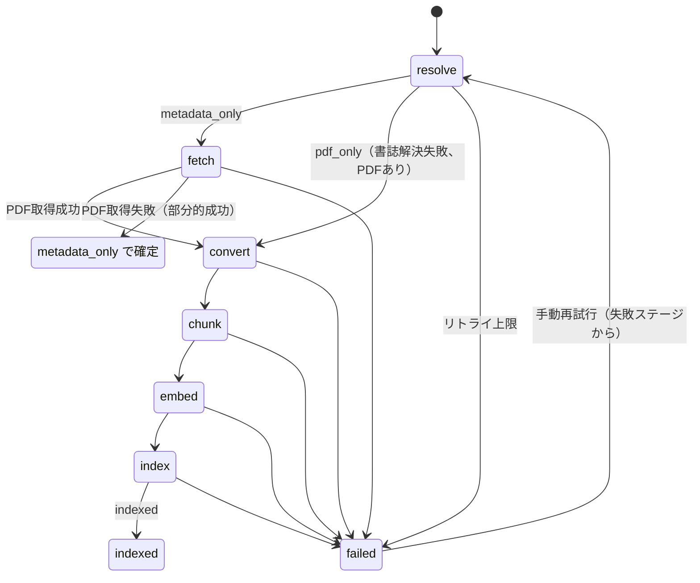

# 04. 取り込みパイプライン

入力（arXiv ID / DOI / PDF / URL）から `status = indexed` の論文を作るまでの非同期パイプライン。
実行単位は `jobs` テーブルの1行（→ [02](02-data-model.md)）。すべての取り込み経路（アプリUI / MCP / URLスキーム）がこのキューを通る。

## 1. ステージ型ステートマシン

ジョブは6ステージを順に進む。各ステージの成果物は `papers/{uuid}/` のファイルまたはDB行として永続化されるため、**失敗したステージから再開できる**（→ [00](00-overview.md) 非機能要件）。

| stage | 処理 | 成果物 | 完了時の `papers.status` |
|---|---|---|---|
| resolve | 入力から書誌メタデータを確定 | `papers` 行 + `meta.json` | `metadata_only`（PDF未取得） |
| fetch | PDFを取得し `pdf_hash` を計算 | `paper.pdf` | `metadata_only`（PDFあり）/ `pdf_only`（書誌未解決） |
| convert | Doclingで変換（→ [05](05-pdf-conversion.md)） | `paper.md` + `paper.docling.json` | `converting`（処理中表示） |
| chunk | 構造化JSONからチャンク生成（→ [06](06-search-rag.md)） | `chunks` 行 | `converting` |
| embed | ワーカーでembedding生成 | `vec_chunks` 行 | `converting` |
| index | FTS5投入・整合性確認 | `fts_chunks` 行 | `indexed` |

- `stub` は引用グラフ用の未取り込み状態（→ [08](08-citation-graph.md)）。取り込み指示でこのパイプラインに乗る
- `failed` はリトライ上限到達時のみ。途中状態（`metadata_only` 等）はエラーではなく正常な部分的成功

## 2. 入力種別とresolve処理

| 入力 | 経路 | resolve処理 |
|---|---|---|
| arXiv ID | UI / MCP `add_paper` / `paperd://import?arxiv=` | arXiv APIで書誌取得。バージョン番号は分離して `arxiv_version` へ |
| DOI | UI / MCP / `paperd://import?doi=` | Crossrefで書誌取得 → S2/OpenAlexで補完 |
| PDFドロップ | UIへのドラッグ&ドロップ | 後述のローカルPDF解決（4節） |
| URL | UIの入力ダイアログ / `paperd://import?url=`（外部連携の汎用入口） | ①URL文字列からarXiv ID / DOIを抽出して上記に帰着 ②`.pdf` で終わるURLは直接ダウンロード → ローカルPDF解決（4節）へ ③それ以外は**Webページとして取得し、`citation_*` メタタグ（Google Scholar標準。Zotero等と同じ機構）から解決**: `citation_doi` / `citation_arxiv_id` があればID解決に帰着、なければタグの書誌（タイトル・著者・年・誌名等）を採用し、タイトルでCrossref bibliographic検索によるDOI補強（4節と同じ検証規準）を試みる。`citation_pdf_url` はPDF取得源として保持。**メタタグが無いページは恒久的エラー**（リトライせず即failed。DOI/arXiv IDでの追加を案内） |
| MCP `add_paper` | `jobs` へのINSERT（→ [07](07-mcp-server.md)） | payloadの識別子種別に応じて上記に帰着 |

## 3. メタデータ解決の優先順

1. **arXiv ID** → arXiv API（タイトル・著者・abstract・カテゴリ）
2. **DOI** → Crossref（出版情報・bibtex生成に必要なフィールド）
3. **補完** → Semantic Scholar / OpenAlex で `abstract`（Crossrefは欠落が多い）、`s2_paper_id`、`openalex_id`、
   **`arxiv_id`（S2のexternalIds。出版版DOIからプレプリントへの橋渡し）**、
   **OAリンク（OpenAlexの `best_oa_location.pdf_url`。Unpaywall由来データでメールアドレス不要）** を取得。
   引用グラフの前提となるIDとpaywall時の代替PDF源はここで確定する

arXiv論文に出版版DOIがある場合は両方を保持し、bibtexは出版情報を優先する（→ [02](02-data-model.md)）。

**タイトル等のサニタイズ**: Crossref等はタイトル・誌名に生のJATS/MathML/HTMLマークアップ
（`<mml:math>…`、`<i>x</i>`、`<i>` 等）を含めて返すことがある。書誌の適用時
（`ResolvedMetadata.apply`）とstub登録時（`upsertStub`）でタグ除去・エンティティのデコード・
空白正規化を行う（タグの中身のテキストは残す。例: `…in<mml:math…>PbTiO<mml:mn>3</mml:mn>…` →
「…in PbTiO3…」）。既存データの修復は `paperd-cli fix-titles`。

## 4. ローカルPDFのみの場合

1. **テキスト層からの先行解決（Doclingなし・最優先）**: PDFKitでPDFのテキスト層
   （先頭2ページ）を直接読み、印字されたDOI / arXiv IDを抽出する（ミリ秒オーダー）。
   **ID抽出は References / Bibliography / 参考文献 見出しより前のテキストに限定する**
   （短い文書では参考文献が抽出窓に入り、引用先のDOIを自分のIDと誤認するため。
   実例: Supplementary PDFが参考文献[1]のDOIで別論文として登録された交絡バグ）。
   抽出できればその場でID解決し、**変換を待たずに書誌登録・重複検出が完了**する。
   - 重複（既存行がPDF取得済み）はこの時点でcancel — **変換コスト（数十秒〜1分）をゼロでスキップ**
   - 既存のPDF未取得行（metadata_only）へはこの時点で合流
   - 一括取り込み時は全件の書誌が数分で出揃い、変換はバックグラウンドで順次追いつく
   - テキスト層がない（スキャンPDF）・ID未印字の場合は以降のconvert先行フローへフォールバック
2. fetch をスキップし、convert を先行実行してDocling抽出テキストを得る
3. **変換後テキストからのID抽出**: 本文冒頭（**References見出しより前に限定**。上記1と同じ理由）から
   DOI / arXiv IDを抽出できれば、ID解決（3節）に帰着させる。自分のIDを印字する本編論文では
   タイトル検索より誤一致リスクが大幅に低い。自分のIDを持たない文書（Supplementary等）は
   ここで解決されず、タイトル検索の検証で棄却されれば pdf_only に倒れる（誤った身元での登録より安全）
4. ID抽出不能時: Docling抽出タイトルでCrossrefをbibliographic検索（上位数件取得）
   - **タイトル候補の選択**: `title` ラベルを優先。なければ1ページ目の見出しのうち、
     **全大文字でないもの**を優先する（誌名ランニングヘッダが全大文字見出しとして
     抽出されるケースの誤認識対策）
   - **出版版の優先**: 最上位がプレプリント（type = `posted-content`。SSRN等）で、僅差（スコアが最上位の80%以上）に
     出版版（`journal-article` / `proceedings-article`）がある場合は出版版を採用する。
     プレプリントレコードは出版情報（journal・巻号ページ）を持たず、S2/OpenAlexのabstract補完・引用取得も
     効かないことが多いため（同一論文がプレプリントDOIと出版DOIの両方を持つケースの実害対策）
   - **解決結果の検証**: 解決されたタイトルが、抽出タイトル候補と十分に一致するか、
     本文冒頭に（正規化のうえ）含まれる場合のみ採用する。誤った候補（誌名等）での
     見当違いな一致を弾き、不確かなら `pdf_only` に倒す
5. **解決後DOIの重複チェックと合流**: 確定したDOI/arXiv IDが既存行と一致する場合、
   - 既存行がstub（引用グラフ由来 → [08](08-citation-graph.md)）なら、**stub行を取り込み行へ吸収**する
     （引用エッジを取り込み行へ付け替えてstub行を削除。ファイルを持つ取り込み行のIDを正とする）
   - 既存行が**PDF未取得の通常論文（metadata_only）なら、その行へ合流**する
     （既存行のIDを正としてファイルを移動。「URL/IDで書誌のみ登録 → 後からPDFをドロップ」のユースケース）
   - 既存行がPDF取得済みの通常論文なら重複としてジョブをcancel（5節と同じ扱い。作りかけの行とディレクトリは破棄）
6. **未解決時のフォールバック合流**: 書誌解決に失敗しても、既存のPDF未取得論文のタイトルが
   本文冒頭に含まれていれば（正規化一致・一意の場合のみ）、その行へ合流する（ネットワーク不要）
7. それでも未解決なら **`status = pdf_only`** として登録する。検索（FTS5/semantic）は本文に対して機能するが、bibtexは不完全
8. UIで「メタデータ未解決」バッジを表示し、手動解決UI（DOI/arXiv ID入力、候補リストからの選択）を提供する（→ [09](09-ui.md)）

PDFの後付け（6節の部分的成功からの再開）は、**PDFタブのドロップ領域**（→ [09](09-ui.md) 4節）から
対象論文を明示してattachする経路も提供する（推測に依存しない確実な合流手段）。

## 5. 重複検出

resolve完了時およびfetch完了時にチェックする。

| キー | タイミング |
|---|---|
| `doi` 一致 | resolve後 |
| `arxiv_id` 一致 | resolve後 |
| `pdf_hash`（SHA-256）一致 | fetch後 / PDFドロップ直後 |

**並行取り込み時のrace condition対策**: ジョブの並行実行（→ 8節）では「重複チェック → INSERT」が
原子的でないため、同じDOI/arXiv IDに解決される複数ジョブが競走するとDBのUNIQUE制約違反が起きる。
この制約違反は捕捉して**正規の重複検出（cancel）に変換**する（リトライしても直らない違反を
バックオフリトライで浪費しない。実害: 一括投入で3件が8分のリトライ後にfailedになった事例）。

重複検出時はジョブを `cancelled` とし、UIで**既存エントリへのマージ提案**を表示する（新規メタデータで既存行を補完するか、取り込みを破棄するかの選択）。MCP起源の場合は既存 `paper_id` を返してマージ提案は行わない。

## 6. PDF取得（fetch）

| 優先順 | ソース |
|---|---|
| 1 | 解決時に判明したPDF URL（arXivのPDFリンク・Webページの `citation_pdf_url`・**OpenAlexのOAリンク**） |
| 2 | arXiv直接ダウンロード（`arxiv_id` がある場合。**出版版DOIで取り込んでもS2補完でarXiv IDが付く**ため、paywall誌のプレプリント版がここで取れる） |
| 3 | Unpaywall経由のOAリンク（DOIから。politeメール設定時のみ） |
| 4 | ユーザ提供（ドロップ / ファイル選択） |

PDF未取得（metadata_only）の論文には、PDFタブに**「代替PDF（プレプリント等）を自動で探す」**ボタンを
表示する。再解決（補完の再実行）→ fetch再試行のジョブを投入し、上記の探索が最新の補完情報で再走する
（→ [09](09-ui.md) 4節）。

全ソース失敗時は `metadata_only` として登録を完了する（**部分的成功の許容**）。UIから後日PDFを追加でき、その時点でconvert以降が再開される。

## 7. jobsキューとリトライ

- 各ステージ完了時に `jobs.stage` と `updated_at` を更新。再開時は `stage` の次から実行する（成果物がファイルに残っているため冪等）
- 一時的エラー（ネットワーク・API 5xx）は**指数バックオフでリトライ**: 30秒 → 2分 → 10分、最大3回（`retry_count`）
- 上限到達で `jobs.status = failed` + `last_error` 記録、`papers.status = failed`。UIのジョブ一覧にエラー表示と**手動再試行**ボタンを出す
- 恒久的エラー（PDF破損等）はリトライせず即 `failed`
- **重複投入の排除**: `reindex` / `refetch_citations` は同一論文に対するqueued/runningジョブが
  既にあれば投入しない。実害の実例: MCPの修正パッチを5バッチに分けて適用 → reindexが5本積まれ、
  同一論文のembedding再計算が並行実行されてマシン全体が重くなった

## 8. JobRunner actor（Swift）

アプリ内の単一actorがキューを駆動する（→ [01](01-architecture.md) 5節）。

| ジョブ種別 | 並列度 | 理由 |
|---|---|---|
| convert（Docling） | **直列1本**（ワーカー側のジョブキューで構造的に直列化） | ワーカーのメモリ保護（PyTorch + モデルで数GB） |
| embed | バッチ実行（1リクエストに複数チャンク、クライアント16件/リクエスト・ワーカー内batch_size=4） | スループットとMPSメモリの両立 |
| ジョブ実行 | **並行（既定3、バッチ単位）** | 変換中にネットワーク系・embedの待ち時間を隠蔽 |

### resolve優先スケジューリング（一括取り込みの高速化）

新規のingestジョブは **resolve + fetch（書誌確定・PDF配置）まで実行したら一旦キューへ戻し**
（`stage = fetch` のままqueued）、キューの取り出し順は**未解決（stage IS NULL）のジョブを優先**する。

- 一括取り込み時、全件の書誌登録が変換より先に完了し、論文リストに即座に出揃う
- 重い変換（convert以降）はその後にバックグラウンドで順次実行され、完了した論文から全文検索が有効化
- 再開ジョブ（stage設定済み）は中断なく最後まで実行する（PDF後付け・リトライの挙動は不変）

ジョブ検知:

- アプリ起源: JobRunnerが直接enqueue（即時実行）
- MCP / URLスキーム起源: **定期ポーリング（既定5秒、アイドル時は間隔を延長）**が主たる駆動。MCPの `DistributedNotificationCenter` 通知は即時化の補助で、取りこぼしてもポーリングで拾う

## 9. 外部APIのレートリミット

| API | 配慮 |
|---|---|
| arXiv | リクエスト間隔3秒を推奨に従い遵守 |
| Crossref | politeプール: `mailto` パラメータ（ユーザ設定のメールアドレス）を付与 |
| Semantic Scholar | 無認証は厳しめの制限。設定でAPIキー登録を推奨（任意） |
| OpenAlex | `mailto` 付与でpoliteプール |
| Unpaywall | `email` パラメータ必須 |

レートリミット応答（429）はバックオフリトライの対象とし、`Retry-After` ヘッダがあれば優先する。
